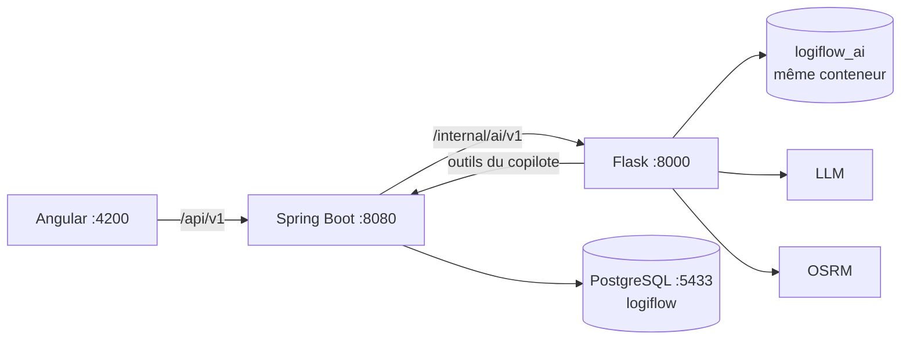

# LogiFlow TMS — Backend

Backend du **TMS LogiFlow** (Transport Management System) pour le transport routier de
marchandises : des commandes aux voyages, de la flotte à la maintenance, avec des agents d'IA
pour planifier les voyages, anticiper la maintenance et répondre aux questions des
utilisateurs.

LogiFlow est composé de **trois projets** :

| Projet | Rôle | Techno | Port local |
|---|---|---|---|
| **`logiflow-backend`** (ce dépôt) | API REST, règles métier, persistance, façade vers l'IA | Java 21, Spring Boot 4.1, Spring Modulith, PostgreSQL | 8080 |
| [`logiflow-ai-service`](../logiflow-ai-service) | Agents IA : copilote, planification, maintenance prédictive, itinéraire | Python 3.13, Flask, LLM compatible OpenAI, OSRM | 8000 |
| [`logiflow-frontend`](../logiflow-frontend) | Interface web | Angular 22, Tailwind 4 | 4200 |



---

## Fonctionnalités

| Domaine | Ce que fait le backend |
|---|---|
| **Référentiel** | Sites (coordonnées, horaires, contraintes d'accès), clients, catalogue de marchandises |
| **Commercial** | Commandes clients et leurs lignes ; confirmation, annulation |
| **Dossiers de transport** | Marchandises, carrosserie et température requises, ADR, fenêtres de chargement et de livraison, statut synchronisé avec le voyage |
| **Voyages** | Arrêts ordonnés avec heures estimées, affectation véhicule, remorque et chauffeurs, **moteur de conformité** (disponibilité sur la période, documents, capacité par tronçon, permis, ADR, temps de conduite), ajout de dossiers à un voyage existant |
| **Suivi** | Événements d'exécution (départ, chargement, livraison, incident, position) |
| **Flotte** | Véhicules et remorques, statut, compteurs, sortie de flotte |
| **Chauffeurs** | Permis, habilitations datées, disponibilité, solde de conduite |
| **Maintenance** | Ordres de travail détaillés (lignes de coût, clôture), plans d'entretien avec échéances, sinistres et suivi assurance, prestataires, contrats d'assurance, coûts, scores de santé |
| **Carburant** | Prises de carburant, stations, consommation |
| **Documents** | Pièces jointes de toutes les entités, avec contrôle d'expiration |
| **IA** | Copilote conversationnel en streaming, planification de voyage assistée, maintenance prédictive (à la demande, chaque nuit et après chaque événement), itinéraire |

---

## Prérequis

- **JDK 21 ou plus récent** (`maven.compiler.release=21`). Maven n'est pas nécessaire : le
  wrapper `./mvnw` télécharge la bonne version.
- **Docker** et Docker Compose : PostgreSQL 18 avec PostGIS et pgvector, pgAdmin.
- Optionnel : le service IA (`logiflow-ai-service`) pour les fonctions `/api/v1/ia/**`.

## Démarrage rapide

```bash
make up                                                   # PostgreSQL (:5433) + pgAdmin (:5050)
./mvnw spring-boot:run -Dspring-boot.run.profiles=local   # ou : make run
```

Au démarrage, l'application :

- applique les migrations Flyway, schéma **et données de démonstration** (profil `local`) ;
- écoute sur `http://localhost:8080`.

```bash
curl http://localhost:8080/actuator/health
```

Ensuite, démarrer le service IA (voir son README) et le frontend (`pnpm start` dans
`logiflow-frontend`).

### Données de démonstration

> Les seeds de démonstration évoluent avec le projet. Après une mise à jour qui les modifie,
> recréez la base locale : `make db-reset`, puis relancez l'application.

Le profil `local` charge `db/migration/seed` (données situées au Maroc, montants en dirhams). Il
contient, entre autres :

- des sites, des clients et des marchandises ;
- une trentaine de véhicules, une quinzaine de remorques et des chauffeurs complets ;
- des commandes et des dossiers à planifier ;
- des voyages ;
- des prestataires, des contrats d'assurance, des plans d'entretien, des OT et des sinistres.

### Authentification en local

Le profil `local` n'utilise **pas** Keycloak : toutes les requêtes sont authentifiées en
`local-dev`, avec le rôle ADMINISTRATEUR (`LocalDevAuthenticationFilter`). Le frontend propose
une session de démonstration : identifiants `admin`, `exploitant`, `responsable`, `commercial`,
`atelier`, `chauffeur`, et mot de passe `demo`. Elle ne sert qu'à adapter l'interface au rôle
choisi. Détails : [docs/security.md](docs/security.md).

### Configuration

Toutes les valeurs ont un **défaut adapté au local** : aucun fichier n'est requis.
[`.env.example`](.env.example) liste les variables disponibles :

- base de données ;
- OAuth2 et MFA ;
- CORS ;
- service IA et ses clés ;
- déclenchements de la maintenance prédictive ;
- stockage des documents et OSRM.

Pour changer une valeur, exportez la variable dans le terminal ou dans la configuration
d'exécution de l'IDE. Docker Compose lit aussi les variables `POSTGRES_*` et `PGADMIN_*` de
l'environnement.

| Profil | Usage |
|---|---|
| `local` | Poste de développement : sans IdP, utilisateur fictif, données de démonstration |
| `dev` | Environnement partagé : JWT Keycloak obligatoire, données de démonstration |
| `test` | Tests d'intégration (Testcontainers) : JWT injecté par les tests, pas d'appel automatique au service IA |
| défaut (prod) | JWT obligatoire, sans données de démonstration |

---

## Architecture en bref

**Monolithe modulaire** (Spring Modulith). Chaque module est un sous-package de
`com.logiflow.tms`, structuré en couches hexagonales :

```
com.logiflow.tms.<module>/
  api/             contrat public : interfaces *Api, DTO, événements (seul point d'entrée des autres modules)
  domain/          modèle métier pur, sans framework ; ports (interfaces)
  application/     cas d'utilisation, transactions
  infrastructure/  REST, JPA, clients HTTP, écouteurs d'événements, tâches planifiées
```

| Module | Rôle | README |
|---|---|---|
| `shared` | Socle technique ouvert (value objects, erreurs, sécurité, pagination) | [README](src/main/java/com/logiflow/tms/shared/README.md) |
| `iam` | Utilisateurs et rôles | [README](src/main/java/com/logiflow/tms/iam/README.md) |
| `referential` | Sites, clients, marchandises | [README](src/main/java/com/logiflow/tms/referential/README.md) |
| `fleet` | Véhicules et remorques | [README](src/main/java/com/logiflow/tms/fleet/README.md) |
| `driver` | Chauffeurs | [README](src/main/java/com/logiflow/tms/driver/README.md) |
| `order` | Commandes | [README](src/main/java/com/logiflow/tms/order/README.md) |
| `dossier` | Dossiers de transport | [README](src/main/java/com/logiflow/tms/dossier/README.md) |
| `planning` | Voyages et conformité | [README](src/main/java/com/logiflow/tms/planning/README.md) |
| `tracking` | Suivi d'exécution | [README](src/main/java/com/logiflow/tms/tracking/README.md) |
| `maintenance` | OT, plans, sinistres, assurance, coûts, scores de santé | [README](src/main/java/com/logiflow/tms/maintenance/README.md) |
| `carburant` | Prises de carburant | [README](src/main/java/com/logiflow/tms/carburant/README.md) |
| `document` | Pièces jointes | [README](src/main/java/com/logiflow/tms/document/README.md) |
| `ai` | Façade des agents IA et outils du copilote | [README](src/main/java/com/logiflow/tms/ai/README.md) |

Les règles d'architecture sont **vérifiées par les tests** :

- `ModularityTest` : dépendances entre modules via `api` seulement, sans cycle ;
- `HexagonalArchitectureTest` : sens des couches ;
- `CodingRulesTest` : règles de code transverses.

Détail et graphe des dépendances : [docs/architecture.md](docs/architecture.md).

---

## Documentation

| Document | Contenu |
|---|---|
| [docs/architecture.md](docs/architecture.md) | Modules, dépendances réelles, événements, flux métier, couches, persistance |
| [docs/agents-ia.md](docs/agents-ia.md) | **Agents IA et copilote** : flux de connexion, authentification, diagrammes de séquence, règles de calcul, dégradation, configuration, dépannage |
| [docs/integration-ia.md](docs/integration-ia.md) | Contrat d'API entre Spring et le service IA |
| [docs/security.md](docs/security.md) | OAuth2 / Keycloak, MFA, rôles, modes locaux, routes internes |
| [docs/conventions.md](docs/conventions.md) | Langue, style, nommage, commits, branches, definition of done |
| [docs/guide.html](docs/guide.html) | Guide de prise en main du code (HTML, en anglais) |
| `docs/adr/` | Décisions d'architecture (liste ci-dessous) |
| `src/main/java/com/logiflow/tms/*/README.md` | Un README par module |

Décisions d'architecture (`docs/adr/`) :

| ADR | Décision |
|---|---|
| [0001](docs/adr/0001-monolithe-modulaire.md) | Monolithe modulaire (Spring Modulith) et architecture hexagonale |
| [0002](docs/adr/0002-connexion-mfa-keycloak.md) | Connexion Keycloak et MFA |
| [0002](docs/adr/0002-orchestration-statut-dossier-voyage.md) | Orchestration des statuts dossier ↔ voyage |
| [0003](docs/adr/0003-station-pas-un-site.md) | Une station-service n'est pas un site |
| [0004](docs/adr/0004-copilote-base-ia-dediee-et-outils.md) | Copilote : base IA dédiée et outils métier |
| [0005](docs/adr/0005-agent-planification-voyage.md) | Agent de planification de voyage (remplace le groupage) |
| [0006](docs/adr/0006-refonte-module-maintenance.md) | Refonte du module maintenance et déclenchement automatique de l'agent |

---

## Commandes (`Makefile`)

| Commande | Effet |
|---|---|
| `make up` | Démarre PostgreSQL et pgAdmin (Docker Compose) |
| `make keycloak` | Démarre Keycloak local (OIDC, port 8081) |
| `make down` | Arrête l'infrastructure locale |
| `make run` | Démarre l'application en profil `local` |
| `make build` | Compile et package sans tests |
| `make test` | Tous les tests : unitaires, intégration, architecture (`./mvnw clean verify`) |
| `make format` | Formate le code (Spotless) |
| `make clean` | Supprime les artefacts de build |
| `make logs` | Suit les logs de PostgreSQL |
| `make db-reset` | **Détruit** et recrée la base locale |

## Tests

| Commande | Portée |
|---|---|
| `./mvnw test` | Tests unitaires : domaine, services, outils du copilote, architecture |
| `./mvnw verify` | Plus les tests d'intégration (Testcontainers PostgreSQL/PostGIS/pgvector) et le contrôle de format Spotless |
| `./mvnw verify -Dit.test=MaintenanceControllerIT -Dtest=NONE -Dsurefire.failIfNoSpecifiedTests=false` | Un seul test d'intégration |

- Les tests d'intégration démarrent leur propre conteneur PostgreSQL : Docker doit tourner.
- Ils n'appellent jamais le vrai service IA : le port est simulé, ou l'URL est volontairement
  injoignable.
- Les données de démonstration y sont chargées : un test ne doit pas supposer une base vide.

---

## Liens utiles (local)

| URL | Contenu |
|---|---|
| http://localhost:8080/swagger-ui.html | Documentation interactive de l'API |
| http://localhost:8080/v3/api-docs | OpenAPI (JSON) |
| http://localhost:8080/actuator/health | Santé |
| http://localhost:8080/actuator/modulith | Structure des modules |
| http://localhost:5050 | pgAdmin (`admin@logiflow.local` / `change-me-local-only`) |

## Dépannage

| Symptôme | Solution |
|---|---|
| `UnsupportedClassVersionError` au démarrage | `JAVA_HOME` pointe vers un JDK trop ancien : `export JAVA_HOME="/c/Program Files/Java/jdk-24"` (adapter le chemin), puis relancer |
| `Connection refused` sur le port 5433 | `make up` n'a pas été lancé, ou le conteneur n'est pas encore sain (`make logs`) |
| `Port 8080 was already in use` | Une autre instance tourne déjà : l'arrêter, ou changer `SERVER_PORT` |
| `Validate failed: Migrations have failed validation` (checksum mismatch) au démarrage | Les données de démonstration (`db/migration/seed`) ont évolué depuis la création de la base locale : `make db-reset` (destructif), puis relancer |
| `/api/v1/ia/**` répond 503 | Le service IA n'est pas démarré : les fonctions sans IA restent utilisables. Voir [docs/agents-ia.md §15](docs/agents-ia.md#15-dépannage) |
| Le frontend reçoit des erreurs CORS | Ajouter son origine à `CORS_ALLOWED_ORIGINS` (par défaut `http://localhost:4200`) |

## Contribuer

Conventional Commits, une branche par sujet, PR revue, `./mvnw clean verify` vert avant merge.
Voir [docs/conventions.md](docs/conventions.md).
