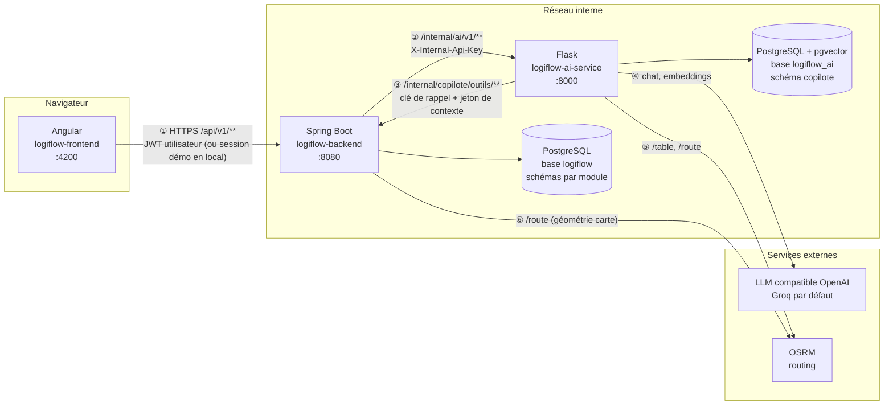
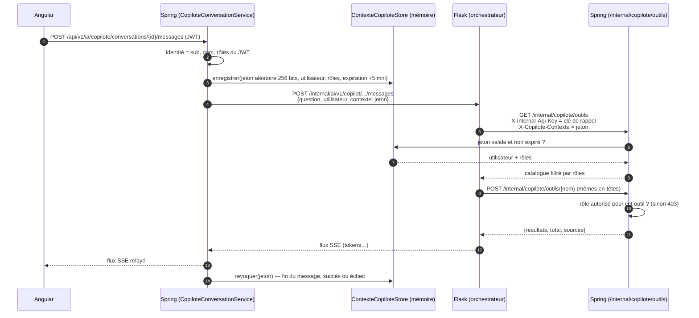
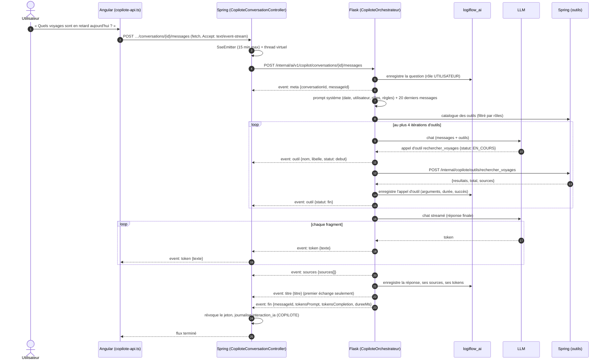
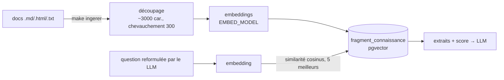
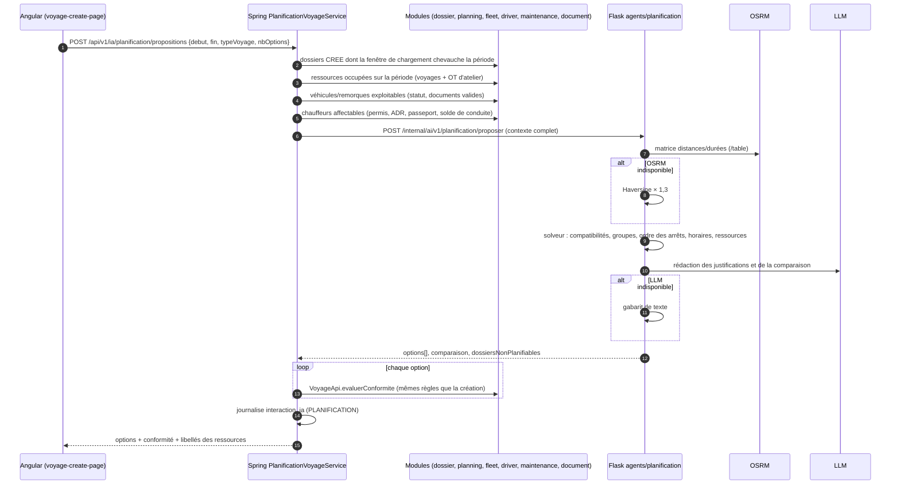
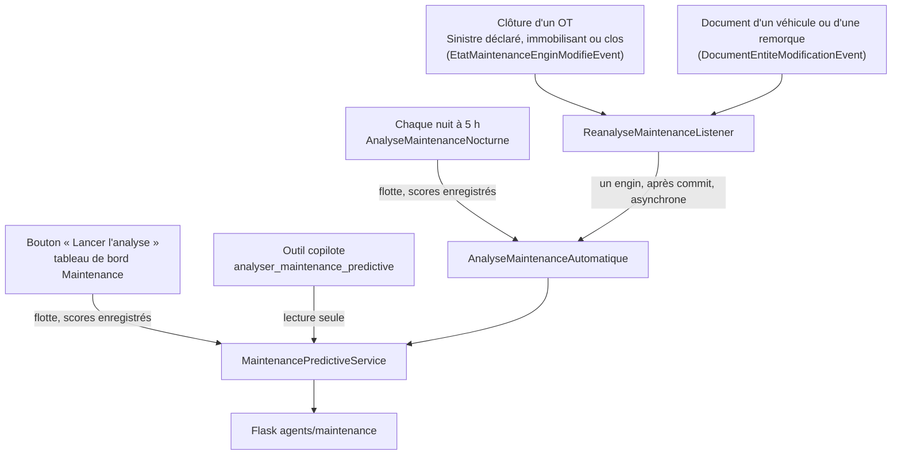
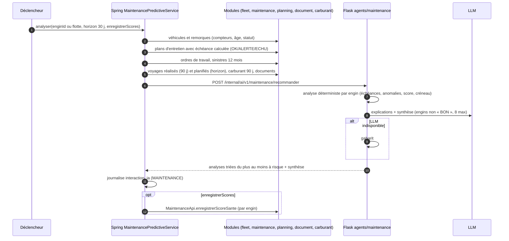
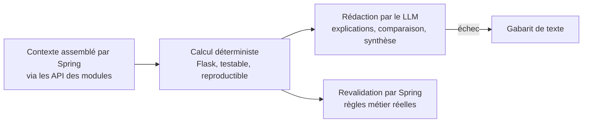

# Agents IA et copilote de LogiFlow — guide détaillé

Ce document explique **comment fonctionnent** les agents IA de LogiFlow : qui appelle qui, avec
quelle authentification, ce qui circule sur chaque connexion, où sont les données, comment chaque
agent calcule sa réponse, et ce qui se passe quand un maillon tombe.

- Le **contrat d'API** champ par champ se trouve dans [integration-ia.md](integration-ia.md).
- Les **décisions** sont dans les ADR :
  - [0004 — copilote](adr/0004-copilote-base-ia-dediee-et-outils.md) ;
  - [0005 — planification](adr/0005-agent-planification-voyage.md) ;
  - [0006 — maintenance](adr/0006-refonte-module-maintenance.md).
- La **structure du code Flask** est décrite dans `docs/architecture.md` du dépôt
  `logiflow-ai-service`.

---

## Sommaire

1. [Vue d'ensemble](#1-vue-densemble)
2. [Les trois projets et leurs connexions](#2-les-trois-projets-et-leurs-connexions)
3. [Authentification et sécurité des flux](#3-authentification-et-sécurité-des-flux)
4. [Copilote conversationnel (chatbot)](#4-copilote-conversationnel-chatbot)
5. [Agent de planification de voyage](#5-agent-de-planification-de-voyage)
6. [Agent de maintenance prédictive](#6-agent-de-maintenance-prédictive)
7. [Agent itinéraire](#7-agent-itinéraire)
8. [Principe commun : calcul déterministe, LLM rédacteur](#8-principe-commun--calcul-déterministe-llm-rédacteur)
9. [Dégradation : que se passe-t-il quand un maillon tombe ?](#9-dégradation--que-se-passe-t-il-quand-un-maillon-tombe-)
10. [Observabilité et traçabilité](#10-observabilité-et-traçabilité)
11. [Configuration de référence](#11-configuration-de-référence)
12. [Démarrer et vérifier en local](#12-démarrer-et-vérifier-en-local)
13. [Tests](#13-tests)
14. [Étendre : ajouter un outil ou un agent](#14-étendre--ajouter-un-outil-ou-un-agent)
15. [Dépannage](#15-dépannage)

---

## 1. Vue d'ensemble

LogiFlow embarque quatre fonctions d'IA :

| Fonction | Pour qui | Ce qu'elle fait | Déclenchement |
|---|---|---|---|
| **Copilote** (chatbot) | Tous les rôles | Répond en langage naturel à partir des **données du TMS** (via des outils métier), de la **documentation** (base de connaissance) et des connaissances du LLM | Panneau « Copilote » de l'interface |
| **Planification de voyage** | Exploitation | Propose plusieurs voyages complets et comparés (dossiers, arrêts, horaires, tracteur, remorque, chauffeurs) sur une période | Création de voyage en mode assisté ; outil copilote `proposer_voyages` |
| **Maintenance prédictive** | Exploitation, atelier | Score de santé de chaque engin, échéances projetées, anomalies, interventions recommandées sur un créneau libre | Bouton « Lancer l'analyse », **chaque nuit**, **après chaque événement** (clôture d'OT, sinistre, document) ; outil copilote |
| **Itinéraire** | Exploitation | Distance, durée et tracé routier entre des points | Fiches voyage (carte) |

Les agents vivent dans une **application Flask séparée** (`logiflow-ai-service`). Le backend Spring
Boot (`logiflow-backend`) est la **seule** porte d'entrée : le frontend Angular ne parle jamais à
Flask.

---

## 2. Les trois projets et leurs connexions



| Connexion | Sens | Protocole | Authentification | Contenu |
|---|---|---|---|---|
| ① | Angular → Spring | HTTP JSON, **SSE** pour le copilote | JWT Keycloak (dev/prod) ; en local, utilisateur fictif `local-dev` (voir [security.md](security.md)) | Toutes les API `/api/v1/**` dont `/api/v1/ia/**` |
| ② | Spring → Flask | HTTP JSON, **SSE** pour le copilote | En-tête `X-Internal-Api-Key` = `AI_SERVICE_API_KEY` | Contexte métier complet assemblé par Spring |
| ③ | Flask → Spring | HTTP JSON | `X-Internal-Api-Key` = **clé de rappel** `AI_SERVICE_CALLBACK_API_KEY` **et** `X-Copilote-Contexte` = jeton valable pour un seul message | Appels d'outils du copilote |
| ④ | Flask → LLM | API OpenAI (`/chat/completions` streamé, `/embeddings`, `/models`) | Clé `LLM_API_KEY` (jamais committée) | Prompts, outils, résultats d'outils |
| ⑤ | Flask → OSRM | HTTP | aucune | Coordonnées |
| ⑥ | Spring → OSRM | HTTP | aucune | Coordonnées (tracé affiché sur la carte) |

Règles structurantes :

- **Flask n'accède jamais à la base du TMS.** Tout ce dont un agent a besoin lui est transmis
  par Spring (planification, maintenance, itinéraire) ou obtenu via les **outils** (copilote),
  qui passent par les API publiques des modules et appliquent les droits de l'utilisateur.
- **Flask ne connaît ni le JWT ni Keycloak.** Il reçoit l'identité de l'utilisateur (id, nom,
  rôles) posée par Spring, et ne peut agir en son nom que pendant la durée d'un message.
- **Flask a sa propre base** `logiflow_ai` : conversations, messages, appels d'outils, avis,
  base de connaissance vectorielle.

---

## 3. Authentification et sécurité des flux

### 3.1 Utilisateur → Spring

Spring est un **resource server OAuth2** sans état : chaque requête porte un JWT signé par
Keycloak, dont les rôles (`ADMINISTRATEUR`, `RESPONSABLE_EXPLOITATION`, `EXPLOITANT`,
`COMMERCIAL`, `ATELIER`, `CHAUFFEUR`) deviennent des autorités Spring (`ROLE_…`). Détail complet
(MFA, claims, CORS) : [security.md](security.md).

> En profil `local`, aucun IdP : `LocalDevAuthenticationFilter` authentifie l'utilisateur fictif
> `local-dev` avec le rôle ADMINISTRATEUR. Le frontend garde une **session de démonstration**
> (choix du rôle à la connexion) qui ne filtre que l'interface. Le copilote voit donc en local
> **tous** les outils.

### 3.2 Spring → Flask : clé de service

Chaque appel porte `X-Internal-Api-Key: <AI_SERVICE_API_KEY>`. Flask compare avec
`INTERNAL_API_KEY` (`security.py`) et répond 401 sinon. Seul `GET /health` est public.

### 3.3 Flask → Spring : clé de rappel + jeton de contexte

Le copilote doit lire des données **avec les droits de l'utilisateur qui pose la question** et
de personne d'autre. Une simple clé partagée ne suffit pas : Flask pourrait appeler n'importe
quel outil pour n'importe qui. Spring utilise donc un **jeton de contexte** à usage limité :



Propriétés de ce mécanisme :

| Garantie | Comment |
|---|---|
| Flask ne peut pas élargir ses droits | Les rôles viennent du **store Spring**, jamais de la requête Flask |
| Un jeton volé ne sert pas longtemps | Il est révoqué en fin de message et expire au bout de 5 min au plus (`AI_SERVICE_CONTEXTE_TTL`) |
| Un JWT utilisateur n'ouvre pas les routes internes | Chaîne de sécurité dédiée (`CopiloteSecurityConfig`, `CopiloteOutilsAuthFilter`) qui n'accepte que la clé de rappel + le jeton |
| Deux secrets distincts | `AI_SERVICE_API_KEY` (Spring → Flask) ≠ `AI_SERVICE_CALLBACK_API_KEY` (Flask → Spring) |

Limites connues : secret statique (à remplacer par OAuth2 client-credentials ou mTLS en
production) ; store de jetons en mémoire (affinité de session ou stockage partagé en
multi-instances).

---

## 4. Copilote conversationnel (chatbot)

### 4.1 Ce que voit l'utilisateur

Un bouton « Copilote » ouvre un panneau latéral, disponible sur tous les écrans :

- liste des conversations, avec renommage et suppression ;
- réponse **streamée** mot à mot, en Markdown ;
- pendant l'exécution d'un outil, un indicateur « Recherche des voyages… » ;
- **sources** cliquables sous la réponse (dossier, voyage, véhicule, OT, sinistre…) ;
- bouton **Stop** ;
- avis 👍 / 👎 avec commentaire ;
- état du service : clé LLM absente ou invalide, service IA injoignable.

Code frontend : `src/app/layout/copilote-panel.*` (panneau), `src/app/ia/copilote-store.ts`
(état), `copilote-api.ts` (appels), `copilote-sse.ts` (lecture du flux), `copilote-markdown.ts`
(rendu sûr).

### 4.2 Déroulé complet d'un message



Détails importants :

- **Pourquoi `fetch` et pas `EventSource`** : `EventSource` ne sait faire que des `GET`. Or la
  question part dans le corps d'un `POST`. Le frontend lit donc le flux avec
  `response.body.getReader()` et le découpe en événements (`copilote-sse.ts`).
- **Battements de cœur** : tant que le LLM n'a rien produit (outil en cours, file d'attente du
  fournisseur), Flask émet `event: attente` toutes les 10 s (`COPILOTE_BATTEMENT_S`). Aucun
  proxy ne coupe ainsi la connexion, et Spring ne déclenche pas son délai de silence de 120 s
  (`AI_SERVICE_STREAM_READ_TIMEOUT`).
- **Relais Spring** : Spring ne transforme pas les événements. Il les relaie un à un
  (`SseEmitter`), depuis un thread virtuel qui porte l'identifiant de corrélation.
- **Stop** : le navigateur ferme la connexion. L'écriture suivante de Spring échoue, et Spring
  ferme alors la connexion vers Flask. Le générateur Python reçoit `GeneratorExit` et enregistre
  la réponse partielle avec le statut `interrompu`.
- **Résultats d'outils volumineux** : ils sont tronqués à 12 000 caractères avant d'être rendus
  au LLM.
- **Erreur d'arguments** : un outil qui répond 400 renvoie son `detail` au LLM, qui corrige son
  appel à l'itération suivante.

### 4.3 Événements du flux

| Événement | Émis par | Données | Usage côté interface |
|---|---|---|---|
| `meta` | Flask | `{conversationId, messageId}` | Rattache la réponse au message |
| `attente` | Flask | `{}` | Garde la connexion ouverte (ignoré par l'interface) |
| `outil` | Flask | `{nom, libelle, statut: debut\|fin\|erreur}` | Indicateur « Recherche… » |
| `token` | Flask | `{texte}` | Ajout au texte affiché |
| `sources` | Flask | `{sources: [{type, reference, id}]}` | Liens vers les fiches (`routeSource()` dans `ia/copilote.ts`) |
| `titre` | Flask | `{titre}` | Titre de la conversation |
| `fin` | Flask | `{messageId, tokensPrompt, tokensCompletion, dureeMs}` | Fin du flux |
| `erreur` | Flask **ou** Spring | `{code, message}` | Message d'erreur dans le panneau |

Les codes d'erreur sont `LLM_INDISPONIBLE` et `QUOTA_LLM` (émis par Flask),
`SERVICE_INDISPONIBLE` et `CONVERSATION_INTROUVABLE` (émis par Spring).

### 4.4 Les outils métier

Les outils sont des classes Spring (`ai/application/outils/*Outil.java`) qui implémentent
`OutilCopilote` : nom, libellé, description pour le LLM, schéma JSON des paramètres, rôles
autorisés, exécution. `CatalogueOutilsCopilote` les découvre automatiquement.

Chaque outil lit les données **via les API publiques des modules**, jamais en SQL direct. Il
renvoie des lignes plates et des **sources** (type, référence, id) qui deviennent des liens dans
l'interface.

| Outil | Rôles | Ce qu'il sait faire |
|---|---|---|
| `rechercher_dossiers` | exploitation, COMMERCIAL | Dossiers par statut ou texte |
| `rechercher_commandes` | exploitation, COMMERCIAL | Commandes et leur client |
| `rechercher_clients` | exploitation, COMMERCIAL | Clients |
| `rechercher_voyages` | exploitation | Voyages, ressources, dernier événement de suivi |
| `rechercher_chauffeurs` | exploitation | Chauffeurs, disponibilité, habilitations |
| `lister_vehicules` | exploitation, ATELIER | Véhicules, statut, dernier score de santé |
| `lister_remorques` | exploitation, ATELIER | Remorques |
| `consulter_maintenance` | exploitation, ATELIER | OT et plans d'entretien (échéance, état), véhicules et remorques |
| `rechercher_sinistres` | exploitation, ATELIER | Sinistres, coût net, filtre `OUVERTS` |
| `couts_maintenance` | exploitation, ATELIER | Coûts sur une période, répartitions, sinistralité |
| `analyser_maintenance_predictive` | exploitation, ATELIER | Lance l'agent de maintenance, **en lecture seule** |
| `consommation_carburant` | exploitation, ATELIER | Litres, coût, L/100 km par véhicule ou flotte |
| `proposer_voyages` | exploitation | Lance l'agent de planification sur une période |
| `rechercher_base_connaissance` | tous | **Outil local à Flask** : recherche vectorielle dans la documentation |

« Exploitation » = ADMINISTRATEUR, RESPONSABLE_EXPLOITATION, EXPLOITANT. Un CHAUFFEUR n'a aucun
outil métier.

Les immatriculations saisies librement (« ab123cd », « AB-123-CD ») sont retrouvées par
`ResolveurVehicule` / `ResolveurEngin` (véhicule puis remorque). Le LLM ne manipule jamais
d'identifiants techniques.

### 4.5 Base de connaissance (RAG)



- **Ingestion** : `make ingerer SOURCES="../logiflow-backend/docs/*.md"` (commande
  `flask ingerer`). Le HTML est réduit à son texte. Réingérer un fichier remplace ses fragments.
- **Activation** : l'outil n'est proposé au LLM que si un modèle d'embeddings est configuré
  (`EMBED_*`) et que la base est disponible.

### 4.6 Données conservées (base `logiflow_ai`, schéma `copilote`)

| Table | Contenu |
|---|---|
| `conversation` | Propriétaire (`sub` du JWT), titre, dates |
| `message` | Rôle (utilisateur ou assistant), contenu, statut (`complet`, `interrompu`, `erreur`), sources, tokens, durée |
| `appel_outil` | Outil, arguments, succès, durée, extrait du résultat |
| `feedback` | Note +1/−1 et commentaire |
| `document_connaissance`, `fragment_connaissance` | Documentation ingérée et vecteurs |

Migrations Alembic dans `logiflow-ai-service/migrations/`. Côté TMS, Spring ne conserve que des
**métadonnées** (table `ai.interaction_ia` : type, utilisateur, durée, succès), jamais le
contenu des échanges.

### 4.7 API

- **Frontend → Spring** (`/api/v1/ia/copilote`) :
  - `GET /etat` : état du service IA, du LLM et de la base ;
  - `GET|POST /conversations`, `GET|PATCH|DELETE /conversations/{id}` : gestion des
    conversations ;
  - `POST /conversations/{id}/messages` : envoi d'une question, réponse en **SSE** ;
  - `POST /messages/{id}/feedback` : avis sur une réponse.
- **Spring → Flask** : `/internal/ai/v1/copilot/**`, même découpage ; l'utilisateur est passé
  dans `X-Utilisateur-Id`.
- **Flask → Spring** : `GET /internal/copilote/outils` (catalogue) et
  `POST /internal/copilote/outils/{nom}` (exécution).

L'état du LLM est obtenu par `GET /models` du fournisseur (appel gratuit) : `UP`, `CLE_ABSENTE`,
`CLE_INVALIDE`, `MODELE_ABSENT` ou `DOWN`.

---

## 5. Agent de planification de voyage

### 5.1 Parcours utilisateur

1. Écran **Voyages → Nouveau voyage → mode assisté** : l'exploitant choisit la période, le type
   de voyage (SIMPLE, GROUPAGE, RAMASSE, DISTRIBUTION, NAVETTE), la portée et le nombre
   d'options.
2. L'agent renvoie **jusqu'à 5 propositions comparées** (3 par défaut). Chacune comporte les dossiers groupés, les
   arrêts dans l'ordre avec leurs heures d'arrivée et de départ, le tracteur, la remorque, le ou
   les chauffeurs, des indicateurs (km, durée, remplissage poids et volume, coût, coût à la
   tonne), des alertes, une justification et un verdict de conformité.
3. L'exploitant choisit une option : le formulaire de création est **pré-rempli**. Il relit,
   ajuste, puis crée le voyage.
4. La **planification manuelle** reste disponible à tout moment, y compris si l'IA est
   indisponible.

### 5.2 Flux



### 5.3 Ce que calcule le solveur (Flask)

| Étape | Règle |
|---|---|
| Distances | Matrice OSRM `/table` entre tous les sites ; repli Haversine × 1,3 (`sourceDistances`) |
| Compatibilité des dossiers | Carrosserie, température, ADR, capacité poids / volume / palettes, fenêtres de chargement et de déchargement |
| Groupes | Insertion gloutonne sous contraintes de capacité et d'horaires |
| Ordre des arrêts | Chargement avant déchargement pour chaque dossier (précédence), minimisation du détour |
| Horaires | ETA/ETD par arrêt, temps de service, pause de 45 min toutes les 4 h 30 de conduite, équipage double si nécessaire |
| Ressources | Tracteur + remorque compatibles et libres, chauffeur(s) habilité(s) et proche(s) |
| Options | Une option par objectif, toutes distinctes : `REMPLISSAGE` (remplissage maximal), `ECONOMIE` (coût à la tonne minimal), `COUVERTURE` (le plus de dossiers servis). Si le meilleur candidat d'un objectif est déjà retenu, l'option suivante est libellée « Alternative (…) ». |

Le LLM ne fait que **rédiger** et **recommander** une option parmi celles calculées. Spring
**revalide** chaque option avec les règles réelles de création de voyage : une option n'est
jamais présentée comme conforme sur la seule parole de l'agent.

### 5.4 Intégration avec la maintenance

Un engin retenu à l'atelier sur la période n'est ni proposé par l'agent, ni accepté à la création
d'un voyage. C'est le cas d'un OT planifié ou en cours avec immobilisation
(`MaintenanceApi.indisponibilites`). Le message d'erreur cite l'OT concerné.

---

## 6. Agent de maintenance prédictive

### 6.1 Déclencheurs



| Déclencheur | Portée | Scores enregistrés | Réglage |
|---|---|---|---|
| Bouton | Toute la flotte | Oui | — |
| Copilote | Un engin ou la flotte | **Non** | — |
| Nuit | Toute la flotte | Oui | `AI_MAINTENANCE_CRON` (défaut `0 0 5 * * *`, heure de Paris), `AI_MAINTENANCE_ANALYSE_NOCTURNE` |
| Événement | L'engin concerné | Oui | `AI_MAINTENANCE_REANALYSE_EVENEMENT` |

Les déclenchements automatiques **ne bloquent jamais** l'opération métier :

- l'écoute se fait **après commit**, de façon asynchrone ;
- l'analyse s'exécute **hors de la transaction** de l'écouteur ;
- un échec (service IA indisponible, engin hors service) est seulement journalisé ;
- une seule analyse de flotte à la fois, et une seule réanalyse par engin à la fois.

### 6.2 Flux



### 6.3 Règles d'analyse (Flask, `agents/maintenance/analyse.py`)

**Usage (km/jour)** :

- km des voyages réalisés sur 90 jours ÷ 90 ; pour une remorque, les voyages où elle était
  attelée ;
- à défaut, kilométrage ÷ âge, plafonné à 900 km/jour ;
- à défaut, 250 km/jour.

**Échéances** :

- L'échéance d'un plan (km restants, date, état) vient du module maintenance. La dernière
  réalisation est relevée à la clôture des OT liés.
- L'agent **projette** la date avec l'usage réel, puis l'**avance** si les voyages déjà
  planifiés consomment les km restants.
- L'échéance est en alerte si l'état est ALERTE ou ECHU, si les km restants passent sous le seuil
  d'alerte, ou si la date tombe dans l'horizon analysé.

**Pénalités** (score = 100 − pénalités, borné entre 0 et 100) :

| Situation | Pénalité |
|---|---|
| Échéance dépassée | 45 |
| Échéance en alerte | 25 |
| Document réglementaire expiré (contrôle technique, assurance, carte grise, ADR) | 30, score plafonné à 39 |
| Document expirant dans l'horizon | 10 |
| ≥ 2 réparations en 180 jours (hors réparations de sinistre) | 15 |
| Consommation > 120 % de la médiane des véhicules du même type (≥ 3 véhicules, ≥ 300 km) | 10 |
| ≥ 2 sinistres en 12 mois | 10 |
| Engin immobilisé par un sinistre ouvert | 15 |

**Statut** :

- `BON` si le score est ≥ 80, `SURVEILLER` s'il est ≥ 60, `A_PLANIFIER` s'il est ≥ 40 ;
- `CRITIQUE` en dessous, ainsi que dès qu'une échéance est dépassée en km ou qu'un document est
  expiré.

**Recommandations** :

- **Contenu** : type d'intervention, priorité (`URGENTE` si échue, `HAUTE` sous 7 jours) et date
  limite.
- **Créneau libre** : premier créneau à partir du lendemain 7 h, entre deux voyages planifiés et
  avant l'échéance.
- **`dejaPlanifie`** : vrai si un OT ouvert est rattaché au plan, ou si une réparation de sinistre
  est déjà ouverte.

**Autres anomalies** signalées : OT en attente de pièces, engin actuellement en maintenance ou
immobilisé.

### 6.4 Exploitation dans l'interface

- **Tableau de bord Maintenance** :
  - synthèse et liste des engins à risque, avec leurs explications et recommandations ;
  - pour chaque recommandation, « **Planifier l'OT** » ouvre le formulaire d'OT pré-rempli :
    origine `AGENT_IA`, engin, type, priorité, créneau proposé, justification.
- **Fiches véhicule** : le dernier score de santé enregistré.

---

## 7. Agent itinéraire

- `POST /api/v1/ia/itineraires/calcul` → Flask `POST /internal/ai/v1/itinerary/calculer` →
  OSRM `/route` : distance, durée et segments entre des points ordonnés.
- `POST /api/v1/ia/itineraires/geometrie` : tracé de la route pour la carte. Spring appelle
  directement OSRM (`OsrmRouteGeometryAdapter`), en 8 s au plus.
- Pas de repli : sans moteur de routing, une distance estimée serait trompeuse. La réponse est
  alors 503.

---

## 8. Principe commun : calcul déterministe, LLM rédacteur

Tous les agents métier suivent le même schéma :



Pourquoi :

- **Fiabilité** : un chiffre, un horaire ou un score ne dépend jamais d'une génération de texte.
- **Testabilité** : le calcul est couvert par des tests unitaires sans LLM ; le LLM est simulé
  (`respx`).
- **Coût et disponibilité** : un appel LLM par analyse, et un résultat toujours rendu, même sans
  LLM (`sourceRedaction = GABARIT`).
- **Sécurité** : le LLM ne voit que des données déjà filtrées par Spring, et ne décide d'aucune
  écriture.

Seul le copilote laisse le LLM choisir ses actions, et uniquement parmi des outils **en lecture**,
autorisés pour l'utilisateur.

---

## 9. Dégradation : que se passe-t-il quand un maillon tombe ?

| Panne | Copilote | Planification | Maintenance | Itinéraire |
|---|---|---|---|---|
| **Flask injoignable** | `erreur SERVICE_INDISPONIBLE` ; état « service IA injoignable » | 503 → l'écran propose la planification manuelle | 503 à la demande ; déclencheurs automatiques journalisés et ignorés ; scores et OT restent utilisables | 503 |
| **LLM indisponible ou quota** | `erreur LLM_INDISPONIBLE` / `QUOTA_LLM` | Options calculées, textes par gabarit | Analyse complète, textes par gabarit | Sans effet |
| **Clé LLM absente** | État `CLE_ABSENTE` affiché | Gabarit | Gabarit | Sans effet |
| **OSRM indisponible** | Sans effet | Distances Haversine × 1,3 (`sourceDistances = HAVERSINE`) | Sans effet | 503 |
| **Base `logiflow_ai` indisponible** | Conversations indisponibles | Sans effet | Sans effet | Sans effet |
| **Spring injoignable depuis Flask** | Réponse sans données métier (sans outils) | — | — | — |

Côté Flask, un service externe en panne est traduit en **503**, jamais en 500. Spring distingue
ainsi une panne tierce d'un bug.

---

## 10. Observabilité et traçabilité

- **Identifiant de corrélation** :
  - posé par Spring (`CorrelationIdFilter`, en-tête `X-Correlation-Id`) ;
  - transmis à Flask dans le corps (`correlationId`) et dans les appels d'outils ;
  - présent dans les journaux JSON des deux services, ce qui permet de suivre une question de bout
    en bout.
- **`ai.interaction_ia`** (base TMS) : chaque appel à un agent, avec son type (`COPILOTE`,
  `PLANIFICATION`, `MAINTENANCE`, `ITINERAIRE`), l'utilisateur, le succès, la durée, un résumé et
  l'erreur éventuelle.
- **`copilote.*`** (base IA) : contenu des conversations, appels d'outils avec leur durée, tokens
  consommés, avis des utilisateurs. C'est la base de l'évaluation de la qualité du copilote.
- **Journaux** : `Score de santé recalculé pour l'engin … (motif)`,
  `Analyse de maintenance de la flotte : N engin(s)`, `Rédaction LLM indisponible, repli par
  gabarit`, etc.

---

## 11. Configuration de référence

### Spring (`application.yml`, préfixe `logiflow`)

| Variable | Propriété | Défaut | Rôle |
|---|---|---|---|
| `AI_SERVICE_BASE_URL` | `ai-service.base-url` | `http://localhost:8000` | URL de Flask |
| `AI_SERVICE_API_KEY` | `ai-service.api-key` | `local-dev-key` | Clé Spring → Flask |
| `AI_SERVICE_CALLBACK_API_KEY` | `ai-service.callback-api-key` | `local-dev-callback-key` | Clé Flask → Spring (outils) |
| `AI_SERVICE_CONNECT_TIMEOUT` | `ai-service.connect-timeout` | `2s` | Connexion à Flask |
| `AI_SERVICE_READ_TIMEOUT` | `ai-service.read-timeout` | `30s` | Réponse de Flask (planification, maintenance) |
| `AI_SERVICE_STREAM_READ_TIMEOUT` | `ai-service.stream-read-timeout` | `120s` | Silence maximal du flux copilote |
| `AI_SERVICE_CONTEXTE_TTL` | `ai-service.contexte-ttl` | `5m` | Validité du jeton de contexte |
| `AI_MAINTENANCE_ANALYSE_NOCTURNE` | `ai.maintenance.analyse-nocturne` | `true` | Analyse de nuit |
| `AI_MAINTENANCE_CRON` | `ai.maintenance.cron` | `0 0 5 * * *` | Heure de l'analyse de nuit (Paris) |
| `AI_MAINTENANCE_REANALYSE_EVENEMENT` | `ai.maintenance.reanalyse-sur-evenement` | `true` | Réanalyse après événement |
| `AI_MAINTENANCE_HORIZON_JOURS` | `ai.maintenance.horizon-jours` | `30` | Horizon des analyses automatiques |
| `OSRM_BASE_URL` | `osrm.base-url` | démo publique | Tracé cartographique |

### Flask (`.env`, voir `.env.example`)

| Variable | Défaut | Rôle |
|---|---|---|
| `INTERNAL_API_KEY` | `local-dev-key` | Doit être égale à `AI_SERVICE_API_KEY` |
| `DATABASE_URL` | base `logiflow_ai` locale | Conversations et base de connaissance |
| `LLM_BASE_URL`, `LLM_API_KEY`, `LLM_MODEL` | Groq, vide, `openai/gpt-oss-120b` | Fournisseur LLM compatible OpenAI |
| `LLM_TIMEOUT_S`, `LLM_STREAM_TIMEOUT_S` | 30, 120 | Délais LLM |
| `LLM_TEMPERATURE`, `LLM_MAX_TOKENS` | 0,2, 1024 | Génération |
| `EMBED_BASE_URL`, `EMBED_API_KEY`, `EMBED_MODEL` | vides | Embeddings (base de connaissance) |
| `BACKEND_BASE_URL` | `http://localhost:8080` | Spring, pour les outils |
| `BACKEND_CALLBACK_API_KEY` | `local-dev-callback-key` | Doit être égale à `AI_SERVICE_CALLBACK_API_KEY` |
| `BACKEND_TIMEOUT_S` | 60 | Délai d'un appel d'outil (`proposer_voyages` peut être long) |
| `COPILOTE_MAX_ITERATIONS_OUTILS` | 4 | Tours d'outils maximum par message |
| `COPILOTE_HISTORIQUE_MAX` | 20 | Messages d'historique renvoyés au LLM |
| `COPILOTE_TITRE_LLM` | true | Titre généré par le LLM |
| `COPILOTE_BATTEMENT_S` | 10 | Intervalle des battements `attente` |
| `OSRM_BASE_URL`, `OSRM_TIMEOUT_S` | démo publique, 10 | Routing |

> Les clés (`LLM_API_KEY` notamment) vivent uniquement dans le `.env` non versionné.

---

## 12. Démarrer et vérifier en local

```bash
# 1. Infrastructure (PostgreSQL TMS + base logiflow_ai)
cd logiflow-backend && make up

# 2. Backend (migrations + données de démonstration)
./mvnw spring-boot:run -Dspring-boot.run.profiles=local

# 3. Service IA
cd ../logiflow-ai-service && cp .env.example .env   # renseigner LLM_API_KEY
make install && make migrate && make run

# 4. Frontend
cd ../logiflow-frontend && pnpm install && pnpm start
```

Vérifications rapides :

```bash
curl http://localhost:8000/health                          # Flask, LLM, base
curl http://localhost:8080/api/v1/ia/copilote/etat         # vu depuis Spring
curl -X POST http://localhost:8080/api/v1/ia/maintenance/analyse \
     -H "Content-Type: application/json" -d '{"horizonJours":30,"enregistrerScores":false}'
curl -X POST http://localhost:8080/api/v1/ia/planification/propositions \
     -H "Content-Type: application/json" \
     -d '{"debut":"2026-09-26T06:00:00Z","fin":"2026-09-29T18:00:00Z","typeVoyage":"GROUPAGE"}'
```

---

## 13. Tests

| Où | Quoi |
|---|---|
| Flask (`make test`) | Solveur de planification, analyse de maintenance, orchestrateur du copilote (LLM et Spring simulés par `respx`), repositories en mémoire ; repositories SQL si `TEST_DATABASE_URL` est défini |
| Spring (unitaires) | Outils du copilote, catalogue et rôles, déclenchements automatiques, services applicatifs |
| Spring (intégration) | Contrôleurs IA avec le port Flask simulé (`@MockitoBean`), sécurité des routes internes, chemin 503 (URL Flask injoignable) |
| Frontend (Vitest) | Lecture SSE, store du copilote, rendu Markdown, liens de sources, pré-remplissage d'OT depuis une recommandation |

Aucun test n'appelle un vrai LLM ni un vrai OSRM. Les déclenchements automatiques de maintenance
sont désactivés dans le profil de test.

---

## 14. Étendre : ajouter un outil ou un agent

### Ajouter un outil au copilote

1. Créer `ai/application/outils/MonOutil.java` qui implémente `OutilCopilote` :
   - `nom()` en snake_case ;
   - une `description()` qui dit **quand** l'utiliser ;
   - `parametres()` via `SchemaOutil` ;
   - `rolesAutorises()` ;
   - `executer()`, qui lit **via l'`api` des modules** et renvoie `ResultatOutil(lignes, total,
     sources)`.
2. Pour que les sources deviennent des liens, ajouter leur type dans `ROUTES_SOURCES` et
   `LIBELLES_SOURCES` (`logiflow-frontend/src/app/ia/copilote.ts`).
3. Tests : un test unitaire de l'outil, et l'ajout de son nom dans
   `CopiloteOutilsControllerIT.chaqueOutilDuCatalogueSExecuteSansArguments`.
4. Documenter l'outil dans la table du §4.4 et dans [integration-ia.md](integration-ia.md).

Aucune modification n'est nécessaire côté Flask : le catalogue est découvert dynamiquement.

### Ajouter un agent

1. **Flask** :
   - `agents/<nom>/schemas.py` : contrat Pydantic `CamelModel` ;
   - `agents/<nom>/service.py` : calcul déterministe puis rédaction LLM avec repli ;
   - `api/v1/<nom>.py` : blueprint, validation et 503 ;
   - tests.
2. **Spring** :
   - `ai/domain/model/<nom>` : records du contrat ;
   - un port `…ClientPort` et un adaptateur `…HttpAdapter` ;
   - un service applicatif qui assemble le contexte via les `api` des modules et journalise
     `interaction_ia` ;
   - un contrôleur `/api/v1/ia/<nom>` ;
   - un IT avec le port simulé.
3. **Frontend** : un client dans `src/app/ia/` et un écran ou une intégration.
4. **Documentation** : ce guide, [integration-ia.md](integration-ia.md) et un ADR si la décision
   structure le système.

---

## 15. Dépannage

| Symptôme | Cause probable | Action |
|---|---|---|
| « Service IA injoignable » dans le copilote | Flask arrêté ou mauvaise `AI_SERVICE_BASE_URL` | `curl localhost:8000/health` ; relancer `make run` |
| 401 dans les journaux Flask | `INTERNAL_API_KEY` ≠ `AI_SERVICE_API_KEY` | Aligner les deux valeurs |
| Le copilote répond sans données (« je n'ai pas accès… ») | Appels d'outils refusés : clé de rappel différente, jeton expiré, rôle sans outil | Vérifier `BACKEND_CALLBACK_API_KEY` = `AI_SERVICE_CALLBACK_API_KEY` ; journaux Spring `CopiloteOutilsAuthFilter` |
| État `CLE_ABSENTE` / `CLE_INVALIDE` | `LLM_API_KEY` vide ou refusée | Renseigner une clé valide dans `.env` de Flask |
| `QUOTA_LLM` | Palier gratuit épuisé | Attendre ou changer de modèle ou de fournisseur (`LLM_MODEL`, `LLM_BASE_URL`) |
| Planification avec `sourceDistances = HAVERSINE` | OSRM injoignable | Vérifier `OSRM_BASE_URL` et l'accès réseau |
| Aucun score recalculé après une clôture d'OT | Réanalyse désactivée, Flask arrêté ou engin hors service | Journaux Spring « Réanalyse de maintenance … » ; `AI_MAINTENANCE_REANALYSE_EVENEMENT` |
| Base de connaissance jamais utilisée | Pas de modèle d'embeddings, ou rien d'ingéré | Configurer `EMBED_*`, puis `make ingerer` |
