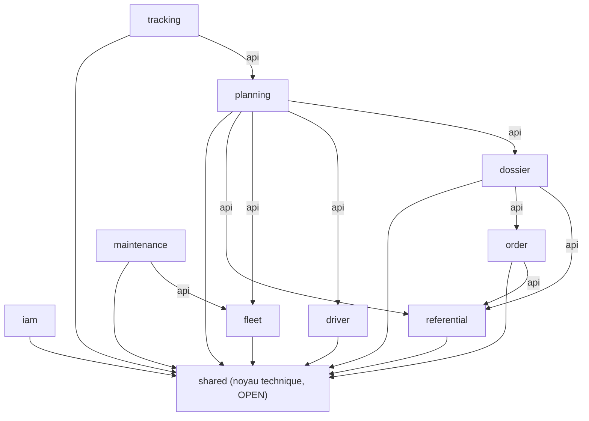
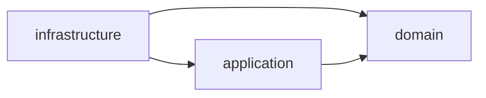

# Architecture

LogiFlow TMS est un **monolithe modulaire** (Spring Modulith) dont chaque module métier est
structuré en **architecture hexagonale**. Ce document explique les deux niveaux et la manière
dont ils s'articulent.

## Niveau 1 — Modularité (Spring Modulith)

Chaque sous-package direct de `com.logiflow.tms` est un module Spring Modulith :

```
shared · iam · referential · fleet · driver · order · dossier · planning · maintenance · tracking
```

Règles imposées par Spring Modulith (vérifiées par `ModularityTest.laStructureModulaireEstValide`) :

- Un module ne peut être utilisé par un autre que via son package **`api`** (ou par un événement
  de domaine). Toute dépendance directe vers `domain` ou `infrastructure` d'un autre module est
  interdite et cassera le build.
- `shared` est le seul module déclaré `@ApplicationModule(type = Type.OPEN)` : c'est le socle
  technique commun (value objects, exceptions, audit, gestion d'erreurs), accessible depuis
  n'importe quel package de n'importe quel module.
- Aucun cycle n'est toléré entre modules.

### Dépendances autorisées entre modules



`iam` n'apparaît dans aucune flèche `api` sortante : les autres modules consomment le contexte de
sécurité via `shared.infrastructure.security` (branché sur le JWT), pas via un appel direct au
module `iam`.

## Niveau 2 — Architecture hexagonale (au sein d'un module)

Chaque module est structuré en 4 couches :

```
<module>/
  api/             contrat public : DTO publics, interfaces exposées, événements de domaine
  domain/          modèle métier pur : entités, value objects, règles, ports (interfaces)
  application/     cas d'utilisation : orchestration, transactions, commandes
  infrastructure/  adaptateurs : web (REST), persistance (JPA), clients externes
```

Sens des dépendances (toujours vers l'intérieur) :



- **`domain`** ne dépend d'aucun framework (pas de Spring, JPA, Jackson, Lombok). Il exprime les
  règles métier avec des types Java purs (records, classes immuables, `java.time.*`).
- **`application`** orchestre le domaine à travers des **ports** (interfaces définies dans
  `domain.port.out`) et porte les transactions (`@Transactional`), jamais les couches externes.
- **`infrastructure`** implémente les ports du domaine (adaptateurs JPA), expose l'API REST, et
  traduit entre entités JPA / modèle de domaine via des mappers MapStruct. Les entités JPA ne
  sortent jamais de `infrastructure.persistence` ; les contrôleurs ne manipulent que des DTO.

Ces règles sont vérifiées automatiquement par `HexagonalArchitectureTest` (ArchUnit).

## Module de référence : `referential` (sous-domaine Site)

Le module `referential` est implémenté de bout en bout et sert de modèle à dupliquer :

```
referential/
  api/SiteApi.java                         → contrat public consommé par exemple par `planning`
  api/dto/SiteSummary.java
  domain/model/{Site,Client,Horaires}.java
  domain/vo/ContraintesAcces.java
  domain/port/out/{SiteRepository,ClientRepository}.java
  domain/service/SiteDomainService.java
  application/{SiteService,ClientService}.java
  application/command/{CreerSiteCommand,MajSiteCommand}.java
  infrastructure/web/{SiteController,ClientController}.java + dto/
  infrastructure/persistence/entity/{SiteEntity,ClientEntity}.java
  infrastructure/persistence/repository/{SiteJpaRepository,ClientJpaRepository}.java
  infrastructure/persistence/adapter/{SiteRepositoryAdapter,ClientRepositoryAdapter}.java
  infrastructure/persistence/mapper/{SiteMapper,ClientMapper}.java
```

## Concepts métier centraux

| Concept             | Définition                                                                 | Module     |
|----------------------|-----------------------------------------------------------------------------|------------|
| Commande             | Demande commerciale d'un client                                            | `order`    |
| DossierTransport     | Unité transportable et facturable (marchandise + points de chargement)     | `dossier`  |
| Voyage               | Exécution physique : une ressource (véhicule + remorque + chauffeur) pour 1..n dossiers | `planning` |
| Trajet               | Séquence ordonnée d'étapes du voyage, distances/durées/horaires estimés    | `planning` |
| Groupage             | Placement de plusieurs dossiers sur un même voyage                         | `planning` |

## Persistance

- Un schéma PostgreSQL par module (`referential`, `fleet`, `driver`, `commande`, `dossier`,
  `planning`, `maintenance`, `tracking`, `iam`) — `commande` correspond au module `order`, renommé
  pour éviter le mot réservé SQL `ORDER`.
- Migrations Flyway (`src/main/resources/db/migration`), aucune génération de schéma par
  Hibernate (`ddl-auto: validate`).
- Modèle de domaine et entités JPA sont des classes distinctes, reliées par des mappers MapStruct.
