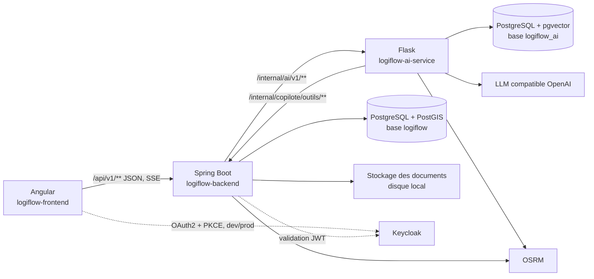
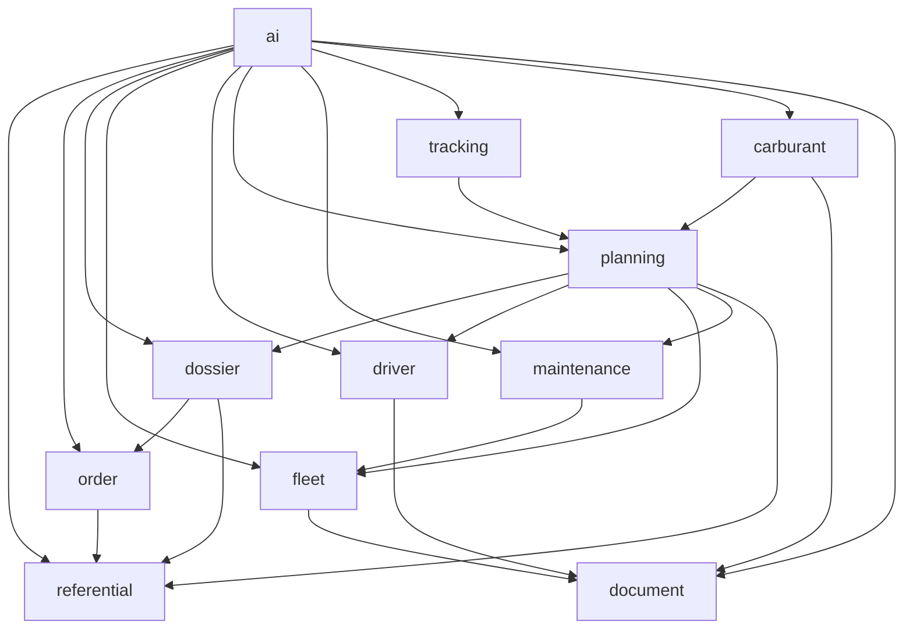
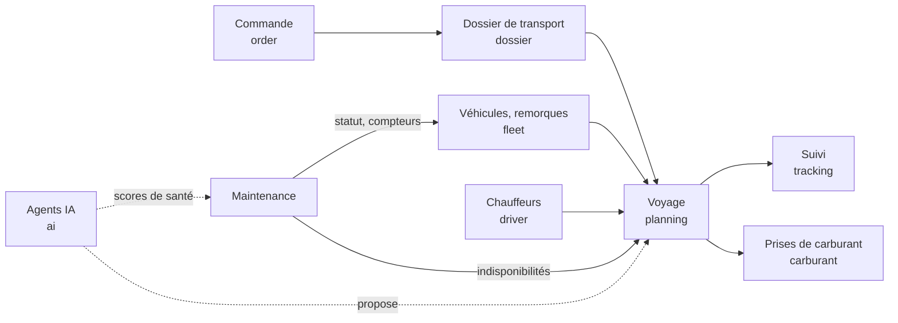
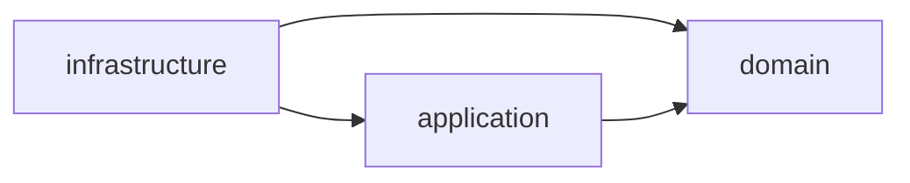

# Architecture

LogiFlow TMS est un **monolithe modulaire** (Spring Modulith) dont chaque module métier est
structuré en **architecture hexagonale**. Les agents d'IA vivent dans un service Flask séparé,
appelé uniquement par ce backend. Ce document décrit les deux niveaux d'architecture du backend,
les modules, leurs dépendances et leurs événements, puis la persistance.

Voir aussi :

- [agents-ia.md](agents-ia.md) : agents IA et copilote (flux, sécurité, fonctionnement) ;
- [integration-ia.md](integration-ia.md) : contrat d'API avec le service IA ;
- [security.md](security.md) : sécurité ;
- [conventions.md](conventions.md) : conventions ;
- [adr/](adr/) : décisions d'architecture.

---

## 1. Vue système



| Élément | Technologie |
|---|---|
| Backend | Java 21 (cible de compilation ; JDK 21 ou plus récent), Spring Boot 4.1, Spring Modulith 2.1, Spring Security 7 (resource server OAuth2), JPA/Hibernate, Flyway, MapStruct, Lombok |
| Base | PostgreSQL 18 avec PostGIS et pgvector (image `docker/postgres/Dockerfile`) |
| Service IA | Python 3.13, Flask, Pydantic, SQLAlchemy / Alembic, httpx |
| Frontend | Angular 22 (signals, signal forms), Tailwind 4, Zard UI, Vitest |
| Tests | JUnit 5, AssertJ, Mockito, Testcontainers, ArchUnit, Spring Modulith Test |

---

## 2. Niveau 1 : modularité (Spring Modulith)

Chaque sous-package direct de `com.logiflow.tms` est un module :

| Module | Schéma SQL | Responsabilité |
|---|---|---|
| `shared` | — | Socle technique **ouvert** : value objects (`Money`, `GeoPoint`, `Reference`…), exceptions, pagination, audit, sécurité, corrélation, gestion d'erreurs RFC 7807 |
| `iam` | `iam` | Utilisateurs et rôles applicatifs |
| `referential` | `referential` | Sites (adresses, coordonnées, horaires, contraintes d'accès), clients, marchandises |
| `fleet` | `fleet` | Véhicules et remorques : caractéristiques, statut, compteurs |
| `driver` | `driver` | Chauffeurs : permis, habilitations (ADR…), disponibilités, temps de conduite |
| `order` | `commande` | Commandes clients et lignes de commande |
| `dossier` | `dossier` | Dossiers de transport : marchandises, fenêtres de chargement et de livraison, statut |
| `planning` | `planning` | Voyages : arrêts, trajet, affectations (véhicule, remorque, chauffeurs), conformité, capacité par tronçon |
| `tracking` | `tracking` | Événements d'exécution des voyages (départ, arrivée, retard…) |
| `maintenance` | `maintenance` | Ordres de travail, plans d'entretien, sinistres, prestataires, contrats d'assurance, coûts, scores de santé |
| `carburant` | `carburant` | Prises de carburant, stations, consommation |
| `document` | `document` | Pièces jointes de toutes les entités (fichier, type, date d'expiration) |
| `ai` | `ai` | Façade vers le service IA : copilote, planification, maintenance prédictive, itinéraire, outils du copilote, journal des interactions |
| `config` | — | Configuration transverse (sécurité, CORS, asynchrone, tâches planifiées) |

Règles vérifiées automatiquement par `ModularityTest` :

- Un module n'en utilise un autre **que via son package `api`** (interfaces, DTO, événements),
  déclaré `@NamedInterface("api")`. Toute dépendance vers le `domain`, l'`application` ou
  l'`infrastructure` d'un autre module casse le build.
- `shared` est le seul module ouvert (`Type.OPEN`).
- **Aucun cycle** entre modules. Quand deux modules doivent se parler dans les deux sens, l'un
  appelle l'`api` de l'autre et l'autre publie un événement.

### 2.1 Dépendances réelles entre modules

Chaque flèche représente un appel à l'`api` d'un autre module. Toutes les flèches vers `shared`
sont omises.



Points notables :

- **`planning → maintenance`** : un engin retenu à l'atelier sur la période d'un voyage est
  refusé (`MaintenanceApi.indisponibilites`).
- **`maintenance → fleet`** par **commandes** : immobiliser, remettre en service, relever les
  compteurs. `fleet` ne dépend pas de `maintenance`.
- **`ai`** est un consommateur pur : il lit tous les modules pour assembler le contexte des
  agents et exécuter les outils du copilote, et aucun module ne dépend de lui.

### 2.2 Événements entre modules

Les événements sont publiés avec `ApplicationEventPublisher` et écoutés par
`@ApplicationModuleListener`, c'est-à-dire de façon asynchrone et après commit. Ils sont
persistés dans le registre de publications Spring Modulith (table `event_publication`, V16).

| Événement (package `api`) | Publié par | Quand | Écouté par | Effet |
|---|---|---|---|---|
| `DocumentEntiteModificationEvent(typeEntite, entiteId)` | `document` | Ajout ou suppression d'une pièce | `carburant` | Contrôle qu'une prise de carburant reste modifiable |
| | | | `ai` | Réanalyse de maintenance d'un véhicule ou d'une remorque |
| `EtatMaintenanceEnginModifieEvent(typeEngin, enginId, motif)` | `maintenance` | Clôture d'OT ; déclaration, immobilisation modifiée ou clôture de sinistre | `ai` | Recalcul du score de santé de l'engin |

### 2.3 Flux métier transverses



- **Commercial vers exploitation** : une commande produit un ou plusieurs dossiers. Le dossier
  est planifié dans un voyage, seul ou groupé, et son statut suit celui du voyage (ADR 0002).
- **Création de voyage** : les arrêts sont construits depuis les sites des dossiers. Le contrôle
  de conformité (`ConformiteVoyageService`) vérifie :
  - la disponibilité des ressources **sur la période**, y compris les OT d'atelier ;
  - les documents valides à la date de départ ;
  - la compatibilité carrosserie et température, et la capacité par tronçon ;
  - les permis, habilitations et temps de conduite des chauffeurs.
- **Maintenance** :
  - la clôture d'un OT relève les compteurs de l'engin, met à jour la dernière réalisation du
    plan lié et remet l'engin en service s'il n'est plus retenu ;
  - un sinistre immobilisant bloque l'engin jusqu'à sa clôture (ADR 0006).

---

## 3. Niveau 2 : architecture hexagonale (dans un module)

```
<module>/
  api/             contrat public : interfaces *Api, DTO *Summary, événements
  domain/          modèle métier pur : agrégats, value objects, règles, ports (domain.port.out)
  application/     cas d'utilisation : orchestration, transactions, commandes
  infrastructure/  adaptateurs : web (REST), persistance (JPA), clients HTTP, écouteurs, tâches planifiées
```



- **`domain`** ne dépend d'aucun framework (ni Spring, ni JPA, ni Jackson). Il exprime les
  règles avec des types Java purs : records, classes immuables, `java.time`.
- **`application`** orchestre le domaine au travers des **ports** et porte les transactions
  (`@Transactional`). Il ne dépend jamais de l'infrastructure, y compris celle de `shared`.
- **`infrastructure`** implémente les ports : adaptateurs JPA et mappers, contrôleurs REST et
  DTO, clients HTTP, écouteurs d'événements, tâches `@Scheduled`. Les entités JPA ne sortent
  jamais de `infrastructure.persistence`.

Règles vérifiées par `HexagonalArchitectureTest` et `CodingRulesTest` (ArchUnit).

### Exemple : le module `maintenance`

```
maintenance/
  api/MaintenanceApi.java, EtatMaintenanceEnginModifieEvent.java
  api/dto/{OrdreTravailSummary, PlanEntretienSummary, SinistreSummary, CoutsMaintenanceSummary, …}.java
  domain/model/{OrdreTravail, PlanEntretien, Sinistre, Prestataire, ContratAssurance, ScoreSante, …}.java
  domain/vo/{EnginRef, LigneCout, Echeance, Tiers}.java
  domain/port/out/{OrdreTravailRepository, SinistreRepository, …}.java
  application/{OrdreTravailService, PlanEntretienService, SinistreService, CoutsMaintenanceService, EnginsFlotte, …}.java
  infrastructure/web/{OrdreTravailController, SinistreController, …}.java
  infrastructure/persistence/{entity, repository, adapter, mapper}/…
```

---

## 4. Concepts métier centraux

| Concept | Définition | Module |
|---|---|---|
| Commande | Demande commerciale d'un client, avec ses lignes | `order` |
| Dossier de transport | Unité transportable et facturable : marchandises, site de chargement, site de livraison, fenêtres horaires | `dossier` |
| Voyage | Exécution physique : un véhicule, éventuellement une remorque, un ou plusieurs chauffeurs, pour 1 à n dossiers | `planning` |
| Arrêt | Passage à un site, ordonné, avec heures d'arrivée et de départ estimées, chargements et déchargements | `planning` |
| Type de voyage | `SIMPLE`, `GROUPAGE` (plusieurs dossiers), `RAMASSE`, `DISTRIBUTION`, `NAVETTE` ; portée `NATIONAL` ou `INTERNATIONAL` | `planning` |
| Conformité | Ensemble des règles bloquantes (et avertissements) vérifiées à la création d'un voyage | `planning` |
| Engin | Véhicule ou remorque, désigné en maintenance par `EnginRef(type, id)` | `maintenance` |
| Ordre de travail (OT) | Intervention d'atelier : lignes de coût, workflow, clôture avec compteurs et facture | `maintenance` |
| Plan d'entretien | Périodicité (km, mois, heures) et dernière réalisation, d'où une prochaine échéance OK / ALERTE / ECHU | `maintenance` |
| Sinistre | Accident, vol, bris… avec suivi assurance, réparations et coût net | `maintenance` |
| Score de santé | Note sur 100 et statut d'un engin, calculés par l'agent de maintenance prédictive | `maintenance` |
| Interaction IA | Trace d'un appel à un agent (type, durée, succès, utilisateur) | `ai` |

---

## 5. Persistance

- **Un schéma PostgreSQL par module** :
  - `referential`, `fleet`, `driver`, `commande` (module `order`, renommé à cause du mot réservé
    `ORDER`), `dossier`, `planning`, `tracking`, `maintenance`, `carburant`, `document`, `iam`,
    `ai` ;
  - plus `public`, pour le registre d'événements.
- **Migrations Flyway** dans `src/main/resources/db/migration` (schéma) et
  `db/migration/seed` (données de démonstration). Hibernate ne génère rien (`ddl-auto:
  validate`).
  - Les profils `local` et `dev` chargent les deux dossiers.
  - Flyway parcourt `db/migration` **récursivement** : les données de démonstration sont donc
    aussi présentes dans les tests d'intégration. Un test ne doit pas supposer une base vide.
- **Modèle et entités séparés** : le modèle de domaine et les entités JPA sont des classes
  distinctes, reliées par des mappers (MapStruct ou manuels).
- **Colonnes JSON** : utilisées pour les collections sans vie propre (lignes de coût d'un OT,
  engins couverts par un contrat, garanties…).
- **Références métier** (`DOS-2026-000012`, `OT-2026-000001`, `SIN-2026-000003`…) : générées par
  des séquences en base (`JpaReferenceSequenceStore`).
- **Documents** : fichiers stockés sur disque (`STORAGE_LOCAL_PATH`), métadonnées dans
  `document.document`.
- **Base du service IA** (`logiflow_ai`, schéma `copilote`) : distincte et gérée par Alembic
  côté Flask. Le backend n'y accède jamais.

---

## 6. Transverse

| Sujet | Mise en œuvre |
|---|---|
| Erreurs | `GlobalExceptionHandler` → RFC 7807 (`ProblemDetail`) : 400 validation, 404, 409, 422 règle métier, 503 service externe |
| Devise | `shared.domain.DeviseApplication` : dirham marocain (MAD) pour tous les montants (commandes, carburant, maintenance, coûts des agents IA) ; affichage « DH » côté interface |
| Corrélation | `CorrelationIdFilter` : en-tête `X-Correlation-Id`, repris dans les logs et transmis au service IA |
| Audit | Colonnes `created_by`, `updated_by`, `created_at`, `updated_at` ; utilisateur issu du JWT (`system` pour les tâches planifiées) |
| Asynchrone | Threads virtuels (`AsyncConfig`) : écouteurs d'événements, relais SSE du copilote |
| Tâches planifiées | `SchedulingConfig` : analyse de maintenance prédictive de nuit |
| Documentation d'API | springdoc : `/swagger-ui.html`, `/v3/api-docs` |
| Supervision | Actuator : `health`, `info`, `metrics`, `prometheus`, `modulith` |
