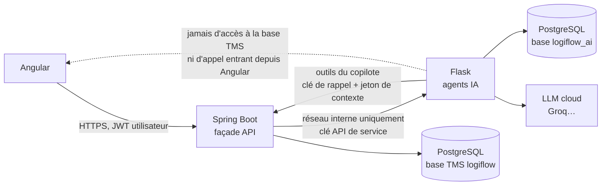

# Intégration avec le service IA (Flask)

## Principe

Les agents IA (planification de voyage, maintenance prédictive, copilote conversationnel,
itinéraire) sont
développés dans une **application Flask séparée** (dépôt `logiflow-ai-service`), déployée et
versionnée indépendamment de ce backend. Les modèles de langage sont servis par un
**fournisseur cloud compatible OpenAI** (Groq par défaut, palier gratuit — voir l'ADR 0004).
L'ancienne cible était **Ollama**,
auto-hébergé sur un serveur dédié (provisionné via Terraform) — aucun appel à une API LLM tierce
payante. L'agent itinéraire s'appuie sur **OSRM** pour le routing (démo publique par défaut,
auto-hébergeable plus tard). Voir `docs/architecture.md` du dépôt `logiflow-ai-service` pour le
détail côté Flask.

**Règle non négociable : Angular ne parle jamais à Flask directement.** Le service Flask n'est
jamais exposé publiquement — il vit sur un réseau interne, accessible uniquement depuis le backend
Spring Boot. Toutes les API consommées par le frontend restent exposées par Spring Boot, qui joue
le rôle de façade (BFF) : il authentifie et autorise l'utilisateur, assemble le contexte métier
nécessaire (en interrogeant ses propres modules via leurs `api` publiques), appelle Flask en
interne, puis renvoie une réponse déjà mise en forme au frontend.



Conséquences de ce principe :

- Flask n'a **aucun accès direct** à la base de données PostgreSQL du TMS : tout ce dont il a
  besoin lui est transmis dans la requête HTTP par Spring Boot, ou — pour le copilote — obtenu en
  appelant les **outils** que Spring expose (voir plus bas). Flask dispose en revanche de **sa
  propre base** (`logiflow_ai`) pour ses données à lui : conversations, messages, base de
  connaissance vectorielle (ADR 0004).
- Flask n'a **aucune connaissance** du JWT utilisateur ni de Keycloak : l'authentification
  utilisateur s'arrête à Spring Boot. Entre Spring Boot et Flask, l'authentification est un
  **secret partagé de service à service** (voir ci-dessous), pas une identité utilisateur.
- Si Flask est indisponible, lent ou renvoie une erreur, l'expérience se dégrade **sans jamais
  casser** les fonctionnalités déterministes déjà implémentées (ex. la planification manuelle
  des voyages et son contrôle de conformité fonctionnent sans IA).

## Authentification service à service

Un en-tête `X-Internal-Api-Key` porte une clé statique partagée, distincte par environnement,
jamais committée (fournie via variable d'environnement `AI_SERVICE_API_KEY`). C'est un choix
pragmatique pour un projet de 8 semaines ; en production, on lui préférerait un flux OAuth2
client-credentials ou du mTLS entre les deux services — voir "Points à vérifier".

## Configuration (Spring Boot)

| Variable d'environnement | Propriété Spring | Rôle |
|---|---|---|
| `AI_SERVICE_BASE_URL` | `logiflow.ai-service.base-url` | URL racine du service Flask (ex. `http://ai-service:8000`) |
| `AI_SERVICE_API_KEY` | `logiflow.ai-service.api-key` | Clé partagée envoyée dans `X-Internal-Api-Key` |
| `AI_SERVICE_CONNECT_TIMEOUT` | `logiflow.ai-service.connect-timeout` | Timeout de connexion (défaut `2s`) |
| `AI_SERVICE_READ_TIMEOUT` | `logiflow.ai-service.read-timeout` | Timeout de lecture (défaut `30s`) |
| `AI_SERVICE_STREAM_READ_TIMEOUT` | `logiflow.ai-service.stream-read-timeout` | Silence maximal sur le flux SSE du copilote (défaut `120s`) |
| `AI_SERVICE_CALLBACK_API_KEY` | `logiflow.ai-service.callback-api-key` | Clé que Flask présente pour rappeler les outils du copilote (≠ `AI_SERVICE_API_KEY`) |
| `AI_SERVICE_CONTEXTE_TTL` | `logiflow.ai-service.contexte-ttl` | Validité d'un jeton de contexte du copilote (défaut `5m`) |

## Contrat d'API interne (Flask)

Toutes les routes sont préfixées `/internal/ai/v1` côté Flask, pour bien les distinguer d'une
éventuelle API publique future. Elles ne sont **jamais** appelées depuis Angular.

### 1. Copilote conversationnel (chatbot) — *implémenté*

Voir l'ADR `docs/adr/0004-copilote-base-ia-dediee-et-outils.md`. Le copilote est un chatbot à
conversations persistées, qui répond à partir des **données du TMS** (via des outils) et des
connaissances du LLM (`openai/gpt-oss-120b` chez Groq par défaut). Les réponses sont
**streamées**.

#### API exposée au frontend (Spring)

| Méthode | Route | Rôle |
|---|---|---|
| `GET` | `/api/v1/ia/copilote/conversations?limite=&decalage=` | Conversations de l'utilisateur, les plus récentes d'abord |
| `POST` | `/api/v1/ia/copilote/conversations` | Crée une conversation (`{"titre": null}`) |
| `GET` | `/api/v1/ia/copilote/conversations/{id}` | Conversation + messages (avec sources) |
| `PATCH` | `/api/v1/ia/copilote/conversations/{id}` | Renomme (`{"titre": "..."}`) |
| `DELETE` | `/api/v1/ia/copilote/conversations/{id}` | Supprime |
| `POST` | `/api/v1/ia/copilote/conversations/{id}/messages` | Pose une question (`{"question": "..."}`) → **`text/event-stream`** |
| `POST` | `/api/v1/ia/copilote/messages/{id}/feedback` | Avis `{"note": 1 ou -1, "commentaire": null}` |

Une conversation d'un autre utilisateur répond 404. L'ancienne route
`POST /api/v1/ia/copilote/questions` (question unique, sans historique) reste disponible pendant la
transition ; elle n'est plus utilisée par le frontend.

#### Événements du flux

Même format sur les deux sauts (Flask → Spring → Angular) : `event: <nom>` + `data: <JSON>`.

| Événement | Données | Sens |
|---|---|---|
| `meta` | `{conversationId, messageId}` | Début de réponse |
| `outil` | `{nom, libelle, statut}` (`debut`, `fin` ou `erreur`) | Outil métier en cours d'exécution |
| `token` | `{texte}` | Fragment de réponse (Markdown) |
| `sources` | `{sources: [{type, reference, id}]}` | Entités citées (liens vers les fiches) |
| `titre` | `{titre}` | Titre généré au premier échange |
| `fin` | `{messageId, tokensPrompt, tokensCompletion, dureeMs}` | Réponse complète |
| `erreur` | `{code, message}` | `LLM_INDISPONIBLE`, `SERVICE_INDISPONIBLE`, `CONVERSATION_INTROUVABLE` |

Fermer la connexion (bouton Stop) interrompt la génération : Spring ferme le flux vers Flask, qui
enregistre la réponse partielle avec le statut `interrompu`.

#### Contrat interne (Flask)

Préfixe `/internal/ai/v1/copilot`, clé `X-Internal-Api-Key`. Pour le CRUD, l'utilisateur est
identifié par l'en-tête `X-Utilisateur-Id` (le `sub` du JWT, posé par Spring). Envoi d'un message :

```json
POST /internal/ai/v1/copilot/conversations/{id}/messages
{
  "question": "Quels voyages sont en cours ?",
  "utilisateur": { "id": "auth0|abc123", "nom": "alice", "roles": ["EXPLOITANT"] },
  "contexte": "<jeton opaque émis par Spring pour ce message>",
  "correlationId": "5e1b3c1a-..."
}
```

#### Outils métier (Flask → Spring)

Pour obtenir une donnée, le LLM appelle un **outil** ; Flask le fait exécuter par Spring :

- `GET /internal/copilote/outils` : catalogue `[{nom, libelle, description, parametres}]`
  (JSON Schema), **filtré selon les rôles** de l'utilisateur ;
- `POST /internal/copilote/outils/{nom}` avec les arguments → `{resultats, total, sources}`.
  Arguments invalides → 400 dont le `detail` est renvoyé au LLM pour qu'il corrige son appel ;
  outil hors droits → 403 ; outil inconnu → 404.

Authentification (chaîne `SecurityFilterChain` dédiée, `CopiloteSecurityConfig`) :
`X-Internal-Api-Key` = **clé de rappel** (`AI_SERVICE_CALLBACK_API_KEY`) **et**
`X-Copilote-Contexte` = jeton de contexte valide. Spring émet ce jeton aléatoire pour chaque
message, le mémorise avec l'utilisateur et ses rôles (TTL 5 min), puis le révoque en fin de flux :
les outils s'exécutent donc toujours avec les droits **réels** de l'utilisateur, jamais avec ce
que Flask pourrait prétendre. Un JWT utilisateur n'ouvre pas ces routes.

| Outil | Rôles | Source |
|---|---|---|
| `rechercher_dossiers` | exploitation, COMMERCIAL | `DossierApi.rechercher` |
| `rechercher_commandes` | exploitation, COMMERCIAL | `CommandeApi.rechercher` + `ClientApi` |
| `rechercher_clients` | exploitation, COMMERCIAL | `ClientApi.rechercher` |
| `rechercher_voyages` | exploitation | `VoyageApi.rechercher` + flotte + `TrackingApi` |
| `rechercher_chauffeurs` | exploitation | `ChauffeurApi.rechercher` |
| `lister_vehicules` | exploitation, ATELIER | `VehiculeApi.rechercher` + `MaintenanceApi` |
| `lister_remorques` | exploitation, ATELIER | `RemorqueApi.rechercher` |
| `consulter_maintenance` | exploitation, ATELIER | `MaintenanceApi.ordresTravail` / `plansEntretien` (véhicules et remorques) |
| `rechercher_sinistres` | exploitation, ATELIER | `MaintenanceApi.sinistres` (coût net, filtre `OUVERTS`) |
| `couts_maintenance` | exploitation, ATELIER | `MaintenanceApi.couts` (totaux, répartitions, sinistralité) |
| `analyser_maintenance_predictive` | exploitation, ATELIER | `MaintenancePredictiveService` (lecture seule, sans enregistrer les scores) |
| `consommation_carburant` | exploitation, ATELIER | `CarburantApi.consommation` |
| `proposer_voyages` | exploitation | `PlanificationVoyageService` (agent de planification) |

« Exploitation » = ADMINISTRATEUR, RESPONSABLE_EXPLOITATION, EXPLOITANT. CHAUFFEUR n'a aucun
outil : le copilote ne lui répond qu'avec les connaissances générales du LLM. Un outil
supplémentaire, `rechercher_base_connaissance` (documentation fonctionnelle, pgvector), est
exécuté localement par Flask sur sa propre base.

### 2. Agent de planification de voyage — *implémenté* (remplace l'agent de groupage)

Voir l'ADR 0005. À partir d'une **période** et d'un **type de voyage**, l'agent propose plusieurs
voyages complets et comparés : dossiers groupés, arrêts ordonnés avec heures d'arrivée,
tracteur + remorque, chauffeur(s), indicateurs et justification. L'exploitant choisit une
proposition, relit le formulaire pré-rempli puis crée le voyage ; la planification manuelle
reste disponible.

#### API exposée au frontend (Spring)

`POST /api/v1/ia/planification/propositions`

```json
{ "debut": "2026-09-27T00:00:00Z", "fin": "2026-10-04T00:00:00Z",
  "typeVoyage": "GROUPAGE", "portee": "NATIONAL", "nbOptions": 3 }
```

`PlanificationVoyageService` :

1. collecte les dossiers `CREE` dont une fenêtre de chargement chevauche la période
   (`DossierApi.candidatsPlanification`), filtrés par portée ;
2. collecte les ressources **libres sur la période** (`VoyageApi.ressourcesOccupees`) et
   exploitables : véhicules et remorques hors maintenance/immobilisation, documents valides à la
   date de début ; chauffeurs sans motif de non-affectation (`ChauffeurApi.listerPourPlanification`) ;
3. envoie ce contexte à Flask ;
4. **revalide chaque option** avec les règles de création de voyage
   (`VoyageApi.evaluerConformite`) : une option n'est jamais présentée comme conforme sur la
   seule parole de l'agent ;
5. journalise l'interaction (`PLANIFICATION`).

Chaque option de la réponse porte un objet `voyage` au format de `POST /api/v1/voyages`
(trajet avec ETA/ETD par étape, affectations TITULAIRE/RENFORT, `arrets` = ordre des sites),
ainsi que `conformite {conforme, bloquants, avertissements}` et les libellés des ressources.
Service IA indisponible → **503** : l'écran propose alors la planification manuelle.

#### Contrat interne (Flask)

`POST /internal/ai/v1/planification/proposer` — requête : `debut`, `fin`, `typeVoyage`,
`nbOptions`, `dossiers[]` (charge, ADR, carrosserie, température, fenêtres de chargement et de
déchargement), `sites[]` (coordonnées), `vehicules[]`, `remorques[]`, `chauffeurs[]` (permis,
habilitations valides, passeport, solde, site de rattachement). Réponse : `options[]`
(`rang`, `objectif`, `dossierIds`, `arrets[]` avec `eta`/`etd`/distances/charge, `vehiculeId`,
`remorqueId`, `chauffeurIds`, `indicateurs`, `alertes`, `justification`, `recommandee`),
`comparaison`, `dossiersNonPlanifiables`, `sourceDistances` (`OSRM` | `HAVERSINE`),
`sourceRedaction` (`LLM` | `GABARIT`).

L'agent est un **solveur déterministe** (matrice OSRM `/table` avec repli Haversine, groupes par
insertion gloutonne, ordre des arrêts avec précédence, horaires avec pauses réglementaires,
choix des ressources) ; le **LLM ne fait que rédiger** justifications et comparaison, avec un
gabarit de repli s'il est indisponible.

#### Création de voyage (module planning)

La création persiste désormais les **arrêts** (construits depuis les sites des dossiers, ou dans
l'ordre imposé par `VoyageRequest.arrets`) et rattache chaque dossier à ses arrêts. Le contrôle
de conformité (`ConformiteVoyageService`) couvre : disponibilité **sur la période**
(chevauchement), documents à la date de départ, tracteur ⇒ remorque, carrosserie et
température, capacité par tronçon, permis/ADR/passeport des chauffeurs, solde de conduite
réparti sur l'équipage ; les fenêtres horaires hors période sont des avertissements. Il est
exposé à blanc par `POST /api/v1/voyages/conformite` ; les ressources libres par
`GET /api/v1/voyages/ressources-disponibles?debut&fin`.

### 3. Agent de maintenance prédictive — *implémenté*

`POST /api/v1/ia/maintenance/analyse` (frontend) → `MaintenancePredictiveService` →
`POST /internal/ai/v1/maintenance/recommander` (Flask). Voir aussi l'ADR 0006 (refonte du module
maintenance).

**Requête Spring → Flask.**

- `dateReference`, `horizonJours` (1 à 180) et la liste `vehicules`. Chaque élément est un
  **engin** : `typeEngin` vaut `VEHICULE` ou `REMORQUE` ; pour une remorque, `type` est la
  carrosserie et `heuresMoteur` les heures du groupe froid.
- Compteurs, `kmRealises` et `litresConsommes` sur 90 jours. Les kilomètres des remorques viennent
  des voyages où elles sont attelées ; leur carburant vaut 0.
- `plans` : périodicités, dernière réalisation (`derniereDate`, `derniereKm`), et échéance
  **calculée par le module maintenance** (`kmRestant`, `dateEcheance`, `etat` = OK, ALERTE ou
  ECHU).
- `ordres` : référence, type, nature, statut, origine, `planId`, `datePlanifiee` (fin réelle si
  terminé), immobilisation, `coutTtc`.
- `documents` : type et date d'expiration.
- `sinistres` des 12 derniers mois : `dateSurvenance`, type, gravité, responsabilité, statut,
  `enginImmobilise`, `coutNet`.
- `voyagesPlanifies` : départ, arrivée et distance, pour avancer les échéances et trouver un
  créneau libre.

**Réponse.** Pour chaque engin, du plus à risque au moins à risque :

- identification : `vehiculeId` (identifiant de l'engin) et `typeEngin` ;
- état : `score` (0 à 100), `statut` (BON, SURVEILLER, A_PLANIFIER ou CRITIQUE), `kmParJour`,
  `consommationL100` ;
- échéances : les `echeances` projetées, `kmAvantEcheance` et `dateEcheance` ;
- `anomalies` : documents expirés, réparations répétées, sinistralité, immobilisation après
  sinistre, OT en attente de pièces, surconsommation ;
- `recommandations` : type d'intervention, priorité, date limite, créneau libre, `dejaPlanifie`
  (vrai quand un OT ouvert est rattaché au plan) ;
- `explication`.

S'y ajoutent `synthese` et `sourceRedaction` (LLM ou GABARIT).

**Traitement.**

- Le calcul est déterministe côté Flask ; le LLM ne rédige que les explications et la synthèse
  (repli par gabarit).
- Spring journalise l'appel (`interaction_ia`, type MAINTENANCE).
- Par défaut, Spring **enregistre le score de santé** de chaque engin dans le module
  maintenance.
- Dans l'écran Maintenance, « Planifier l'OT » ouvre le formulaire d'OT pré-rempli : origine
  `AGENT_IA`, type, priorité, créneau et justification.
- Service IA indisponible → 503 : échéances, OT et scores restent consultables et saisissables.

### 4. Agent itinéraire — *implémenté*

`POST /internal/ai/v1/itinerary/calculer`

Calcule le meilleur trajet routier passant par une liste de points ordonnée (coordonnées WGS84,
format aligné sur le VO partagé `shared.domain.vo.GeoPoint`).

Requête :

```json
{
  "points": [
    { "latitude": 48.8566, "longitude": 2.3522, "libelle": "Site A" },
    { "latitude": 45.7640, "longitude": 4.8357, "libelle": "Site B" }
  ],
  "correlationId": "..."
}
```

Réponse attendue (200) :

```json
{
  "distanceKm": 465.3,
  "dureeMin": 258.4,
  "segments": [
    {
      "depart": { "latitude": 48.8566, "longitude": 2.3522, "libelle": "Site A" },
      "arrivee": { "latitude": 45.7640, "longitude": 4.8357, "libelle": "Site B" },
      "distanceKm": 465.3,
      "dureeMin": 258.4
    }
  ]
}
```

Exposé au frontend par Spring Boot via `POST /api/v1/ia/itineraires/calcul`. Comme pour le
copilote, aucun repli déterministe pertinent en cas d'indisponibilité (503 RFC 7807) : une
distance routière estimée sans moteur de routing serait trompeuse plutôt que simplement absente.

## Journalisation des interactions

Chaque appel à Flask est journalisé en base par le module `ai`
(`ai.infrastructure.persistence.entity.InteractionIaEntity`) : type d'interaction, requête
envoyée (résumé), succès/échec, durée et utilisateur à l'origine — condition nécessaire à
l'évaluation de la qualité des agents (taux d'adoption, précision/rappel) décrite dans le CDC.

Pour le copilote conversationnel, Spring ne journalise que les **métadonnées** (conversation,
durée, succès) : le contenu des échanges, les appels d'outils et les avis 👍/👎 sont conservés
par le service IA dans sa base `logiflow_ai`.

## Environnements

- **Local** : le service Flask (dépôt `logiflow-ai-service`) tourne à côté, avec une clé API LLM et OSRM
  accessibles en local ou sur le réseau. Un bloc `ai-service` commenté est prévu dans
  `docker/docker-compose.yml`, à décommenter une fois le dépôt Flask disponible. Tant qu'il n'est
  pas démarré, Spring Boot fonctionne normalement : seuls les endpoints `/api/v1/ia/**` sont
  affectés (503 pour le copilote, l'itinéraire et la planification assistée, qui renvoie vers la
  planification manuelle).
- **Cible** : projet d'apprentissage, le LLM reste un service cloud ; backend, service IA
  et frontend démarrent dans WSL sur le même réseau interne. Voir le dépôt d'infrastructure une
  fois disponible.
- **CI** : aucun appel réseau réel vers Flask dans les tests — `AiServiceClientPort` est mocké
  dans les tests applicatifs, et les tests d'intégration pointent volontairement vers une URL
  injoignable pour exercer le chemin de dégradation.

## Points à vérifier

- Authentification service-à-service par clé statique : à remplacer par OAuth2
  client-credentials ou mTLS avant toute mise en production réelle.
- Jetons de contexte du copilote stockés en mémoire (`ContexteCopiloteStoreMemoire`) : en
  déploiement multi-instances de Spring, garantir l'affinité ou passer à un stockage partagé.
- Le contrat exact des réponses Flask (noms de champs, formats) est une proposition côté Spring
  Boot : à valider avec l'équipe qui implémente l'application Flask, et à ajuster dans
  `ai.infrastructure.client.dto.*` en conséquence.
- `RestClient` (Spring Framework 7) est utilisé pour l'appel HTTP synchrone : à confirmer que
  l'API n'a pas changé par rapport aux versions Boot 3.2+ où elle a été introduite.
